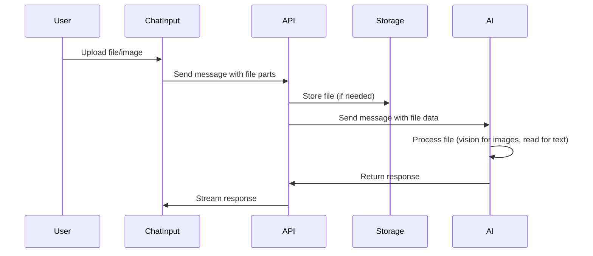
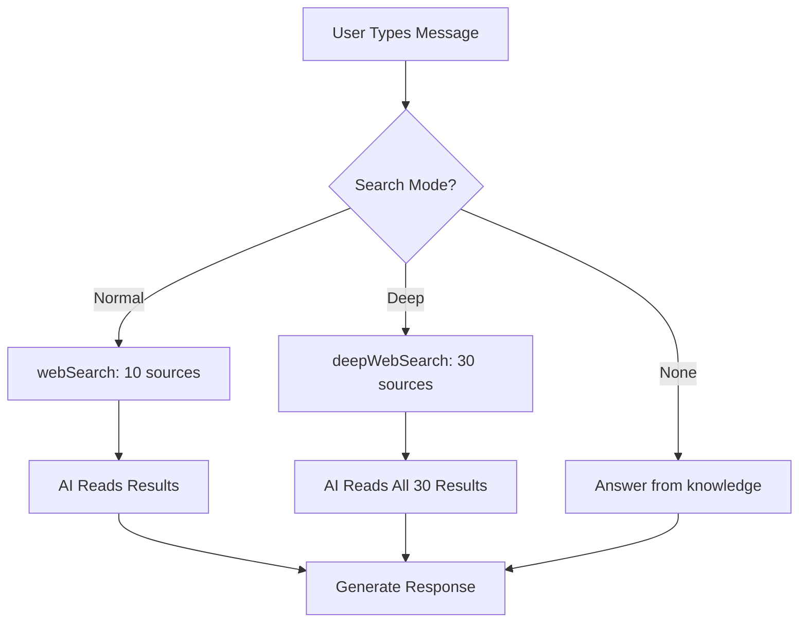
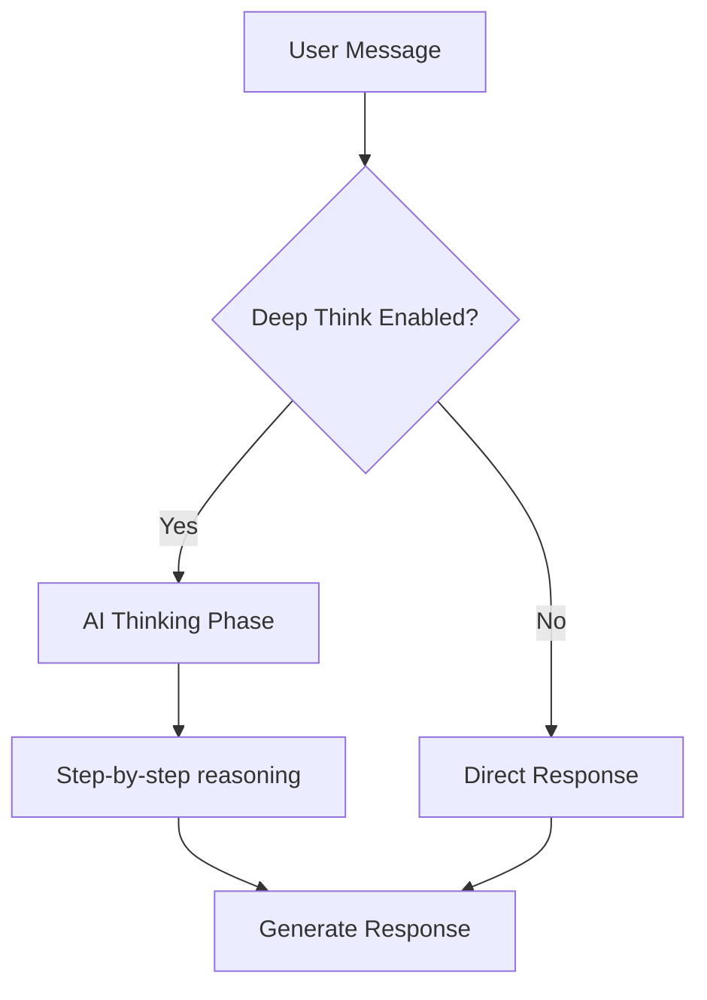

# Transform App to ChatGPT-like Platform

## Overview

Transform the application from a note-taking assistant to a general-purpose ChatGPT-like platform with:

- File and image upload support with AI vision capabilities
- Deep search (30 sources) vs Normal search (10 sources)
- Deep think functionality (AI thinks before answering)
- Enhanced tool selection UI
- Support for multiple AI models (already exists)

## Architecture Changes

### 1. File/Image Upload Support

**Current State**: File upload UI exists in `components/ai-elements/prompt-input.tsx` but files aren't sent in messages.

**Changes Needed**:

- Update `components/chat/chat-input.tsx` to include file parts in messages
- Create file upload API endpoint to handle file storage
- Support vision models for image analysis (Claude, GPT-4 Vision, Gemini)
- Support text file reading for document analysis
- Update `app/api/[[...route]]/chat.ts` to handle file parts in messages

**Files to Modify**:

- `components/chat/chat-input.tsx`: Include files in message parts when sending
- `app/api/[[...route]]/chat.ts`: Process file parts, handle vision for images, read text files
- `lib/ai/providers.ts`: Ensure vision models are properly configured

### 2. Deep Search vs Normal Search

**Current State**: Single `webSearch` tool with 10 results max.

**Changes Needed**:

- Create `deepWebSearch` tool for 30 sources
- Update `webSearch` tool to support configurable maxResults
- Add search mode selection in UI (Normal: 10 sources, Deep: 30 sources)
- Update system prompt to explain both search modes

**Files to Modify**:

- `lib/ai/tools/web-search.ts`: Add `deepWebSearch` function or make it configurable
- `lib/ai/tools/constant.ts`: Add deep search tool to available tools
- `components/chat/chat-input.tsx`: Add search mode selector (Normal/Deep)
- `app/api/[[...route]]/chat.ts`: Handle search mode selection
- `lib/ai/prompt.ts`: Update to explain search modes

### 3. Deep Think Functionality

**Current State**: No thinking/reasoning capability.

**Changes Needed**:

- Add "Deep Think" toggle in chat UI
- When enabled, use reasoning/thinking before answering
- Can be implemented via:
  - System prompt instruction to think step-by-step
  - Using reasoning models (if available)
  - Adding a "thinking" phase before response

**Files to Modify**:

- `components/chat/chat-input.tsx`: Add Deep Think toggle
- `app/api/[[...route]]/chat.ts`: Pass deep think flag to system prompt
- `lib/ai/prompt.ts`: Add thinking instructions when deep think is enabled

### 4. Enhanced Tool Selection UI

**Current State**: Basic tool selection exists.

**Changes Needed**:

- Add search mode selector (Normal Search / Deep Search)
- Add Deep Think toggle
- Keep existing tool selection (Create Note, Search Notes, Web Search)
- Update UI to show selected modes clearly

**Files to Modify**:

- `components/chat/chat-input.tsx`: Add search mode and deep think controls
- `lib/ai/tools/constant.ts`: Add new tool types if needed
- Update tool selection UI layout

### 5. System Prompt Updates

**Current State**: Already updated to ChatGPT-like prompt.

**Changes Needed**:

- Add instructions for file/image handling
- Explain deep search vs normal search
- Add deep think behavior when enabled
- Keep general-purpose ChatGPT-like behavior

**Files to Modify**:

- `lib/ai/prompt.ts`: Add file handling, search modes, and deep think instructions

## Implementation Details

### File Upload Flow

### Search Mode Selection

### Deep Think Flow

## Files to Create/Modify

### New Files

- `lib/ai/tools/deep-web-search.ts`: Deep search tool (30 sources)
- `app/api/upload/route.ts`: File upload endpoint (if needed for storage)

### Modified Files

1. `components/chat/chat-input.tsx`

   - Add file parts to message
   - Add search mode selector (Normal/Deep)
   - Add Deep Think toggle
   - Update UI layout

2. `app/api/[[...route]]/chat.ts`

   - Handle file parts in messages
   - Process images with vision models
   - Read text files
   - Handle search mode selection
   - Pass deep think flag

3. `lib/ai/tools/web-search.ts`

   - Make maxResults configurable
   - Create deepWebSearch variant

4. `lib/ai/tools/constant.ts`

   - Add deep search tool
   - Update tool types

5. `lib/ai/prompt.ts`

   - Add file/image handling instructions
   - Add search mode explanations
   - Add deep think instructions

6. `lib/ai/providers.ts`

   - Ensure vision models are configured

## Implementation Steps

1. **File/Image Upload**

   - Update chat-input to send file parts
   - Handle file processing in API
   - Support vision for images
   - Support text file reading

2. **Search Modes**

   - Create deep search tool
   - Add UI for mode selection
   - Update API to handle mode
   - Update system prompt

3. **Deep Think**

   - Add UI toggle
   - Update system prompt
   - Implement thinking phase

4. **UI Enhancements**

   - Update tool selection UI
   - Add search mode selector
   - Add deep think toggle
   - Improve file upload display

5. **Testing**

   - Test file uploads (images, text files)
   - Test search modes
   - Test deep think
   - Test with different models

## Technical Considerations

- **File Storage**: Decide if files need server storage or can be sent directly to AI
- **Vision Models**: Ensure selected models support vision (Claude, GPT-4 Vision, Gemini)
- **File Size Limits**: Set appropriate limits for uploads
- **Search API**: Tavily API supports up to 10 results by default, may need multiple calls for 30
- **Deep Think**: Can use reasoning models or prompt engineering
- **Performance**: Deep search (30 sources) will be slower, show loading states

## Environment Variables

May need to add:

- File upload size limits
- Storage configuration (if using server storage)
- Vision model configuration
